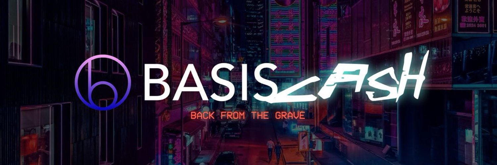

# Basis Cash

Basis Cash is a lightweight implementation of the [Basis Protocol](basis.io) on Ethereum. 

## History of Basis 

Basis is an algorithmic stablecoin protocol where the money supply is dynamically adjusted to meet changes in money demand.  

- When demand is rising, the blockchain will create more Basis Cash. The expanded supply is designed to bring the Basis price back down.
- When demand is falling, the blockchain will buy back Basis Cash. The contracted supply is designed to restore Basis price.
- The Basis protocol is designed to expand and contract supply similarly to the way central banks buy and sell fiscal debt to stabilize purchasing power. For this reason, we refer to Basis Cash as having an algorithmic central bank.

Read the [Basis Whitepaper](http://basis.io/basis_whitepaper_en.pdf) for more details into the protocol. 

Basis was shut down in 2018, due to regulatory concerns its Bond and Share tokens have security characteristics. The project team opted for compliance, and shut down operations, returned money to investors and discontinued development of the project. 

## The Basis Cash Protocol

Basis Cash differs from the original Basis Project in several meaningful ways: 

1. **Rationally simplified** - several core mechanisms of the Basis protocol has been simplified, especially around bond issuance and seigniorage distribution. We've thought deeply about the tradeoffs for these changes, and believe they allow significant gains in UX and contract simplicity, while preserving the intended behavior of the original monetary policy design. 
2. **Censorship resistant** - we launch this project anonymously, protected by the guise of characters from the popular SciFi series Rick and Morty. We believe this will allow the project to avoid the censorship of regulators that scuttled the original Basis Protocol, but will also allow Basis Cash to avoid founder glorification & single points of failure that have plagued so many other projects. 
3. **Fairly distributed** - both Basis Shares and Basis Cash has zero premine and no investors - community members can earn the initial supply of both assets by helping to contribute to bootstrap liquidity & adoption of Basis Cash. 

### A Three-token System

There exists three types of assets in the Basis Cash system. 

- **Basis Cash ($BAC)**: a stablecoin, which the protocol aims to keep value-pegged to 1 US Dollar. 
- **Basis Bonds ($BAB)**: IOUs issued by the system to buy back Basis Cash when price($BAC) < $1. Bonds are sold at a meaningful discount to price($BAC), and redeemed at $1 when price($BAC) normalizes to $1. 
- **Basis Shares ($BAS)**: receives surplus seigniorage (seigniorage left remaining after all the bonds have been redeemed).

### Stability Mechanism

- **Contraction**: When the price($BAC) < ($1 - epsilon), users can trade in $BAC for $BAB at the BABBAC exchange rate of price($BAC). This allows bonds to be always sold at a discount to cash during a contraction.
- **Expansion**: When the price($BAC) > ($1 + epsilon), users can trade in 1 $BAB for 1 $BAC. This allows bonds to be redeemed always at a premium to the purchase price. 
- **Seigniorage Allocation**: If there are no more bonds to be redeemed, (i.e. bond Supply is negligibly small), more $BAC is minted totalSupply($BAC) * (price($BAC) - 1), and placed in a pool for $BAS holders to claim pro-rata in a 24 hour period. 

Read the official [Basis Cash Documentation](https://docs.basis.cash) for more details.

## Motivation

We, the core developers of Basis Cash, were early supporters & observers of Basis when it first launched, and to this day believe that it is one of the best ideas to have ever been put forward in crypto. While Bitcoin first got us interested in blockchain's use cases, it was Basis that first truly inspired us, by painting a picture of a world that runs entirely on decentralized digital dollars the policies for which cannot be corrupted or politicized. Basis is more relevant now today than it ever was in 2017/2018 - with regulators striking back against the decentralized movement by cracking down on Telegram and Libra, while their governments are printing money faster than ever before in human history. 

This is not a DeFi project. We are simply leveraging the industry's excitement in the category to bring much deserved attention and engagement to the Basis Protocol, and to use this opportunity to distribute ownership in the protocol fairly.

Our only motivation is to bring the Basis Protocol into the world, and to serve its community in implementing Basis' vision to become the first widely adopted decentralized dollar. To that end, we are committed to take no financial upside in Basis Cash's success - we will raise no money and premine no tokens. Instead, when we feel that the protocol has found reasonable product market fit, we will ask the Basis Shares DAO for donations to keep contributing to the protocol. 

## How to Contribute

To chat with us & stay up to date, join our [Telegram](https://t.me/basiscash).

Join us on [Discord](https://discord.gg/HhxrRVXy7W)

Contribution guidelines are [here](./CONTRIBUTING.md)

For security concerns, please submit an issue [here](https://github.com/Basis-Cash/basiscash-contracts/issues/new).

_© Copyright 2020, Basis Cash_
